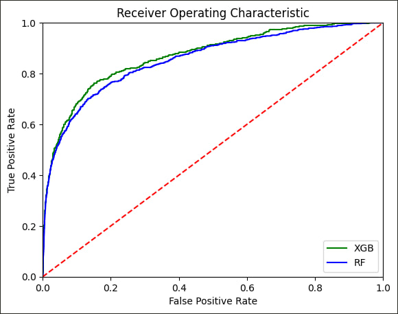

# dsa4266-gnome

## Introduction
Epitranscriptomics, or the study of RNA modifications in biomedical research, has been gaining popularity in recent years owing to a greater focus in precision medicine. RNA modifications refer to chemical modifications of the RNA nucleotides, namely adenosine (A), guanosine (G), cytidine (C), and uridine (U). These modifications might change the structure and function of the RNA, which subsequently leads to the translation of modified proteins that alter the functions of certain cells. In some cases, this will lead to the manifestation of diseases. Previously, RNA modifications could be profiled using experimental protocols followed by short-read sequencing. However, this technique is deemed to be time-consuming, complex, expensive, and highly specialized. Recently, the invention of the Nanopore sequencing technology has provided an easier, faster, and cheaper alternative to detect these RNA modifications, albeit at the cost of lower interpretability. As the technology involves the measurement of electric current through 5 consecutive nucleotides at once, it would be a challenge to determine the identity of modification of certain nucleotide bases just by visualising the signal. As such, the use of artificial intelligence and machine learning techniques is essential to identify these modifications from the data generated by the Nanopore sequencing technology.

## Problem statement
This report focuses mainly on N6-methyladenosine (m6A) modifications due to its abundance in RNA modification and its importance in various biological processes. The methylation of the A-nucleotide is known to be deregulated in Leukemia patients and clinical trials to target this modification suggest better treatment and a greater chance of patient survival.

As such, a suitable machine-learning model to identify M6A RNA modifications from direct RNA-Seq data with high accuracy will be developed. The method will then be applied to analyze data from the SG-NEx project.

## Results
|  | 
|:--:| 
| *Figure 1: ROC Curve of XGB and RF models on same test dataset* |

Metric | Accuracy | AUC ROC | PR ROC
--- | --- | --- | ---
XGB | 94.678 | 87.019 | 43.345
RF | 95.319 | 85.537 | 41.495
*Evaluation metrics on our test dataset (in percentage)*

## Prediction
You can run predictions on (1) our test dataset and (2) full SGNEx data easily.

* Create an ubuntu instance on AWS (>= 8 cpu cores)
* After creating an ubuntu instance on AWS:
```
git clone https://github.com/shaunpabo/dsa4266-gnome.git # enter username and git PAT
cd dsa4266-gnome
bash setup_linux.sh
python3 predict_main.py --test_sample # if you want to run prediction on the test dataset
python3 predict_main.py --sgnex # if you want to run prediction on SGNex data
```